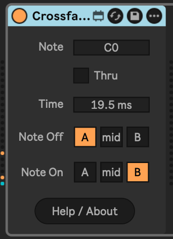

# Crossfader Note

Crossfader Note allows you to dedicate a MIDI note on a track to control the crossfader. You can choose the default crossfader position (note-off) and where it goes on note-on, as well as the time taken to transition.

Thanks to u/leser1 on Reddit for the idea!

## Installation

[Download the .amxd file from the latest release](https://github.com/zsteinkamp/m4l-CrossfaderNote/releases) or clone this repository, and drag the `CrossfaderNote.amxd` device into a track in Ableton Live.

## Changelog

- 2024-09-26 [v1](https://github.com/zsteinkamp/m4l-CrossfaderNote/releases/download/v1/CrossfaderNote-v1.amxd) - Initial release.

## Usage

- `Note` - Sets the MIDI note to trigger the crossfader action.
- `Thru` - Controls whether the above note is sent to the MIDI output of the device.
- `Time` - The duration that the crossfader action takes.
- `Note Off` - The crossfader position for when the note is off.
- `Note On` - The crossfader position for when the note is on.

## TODO

- ...
